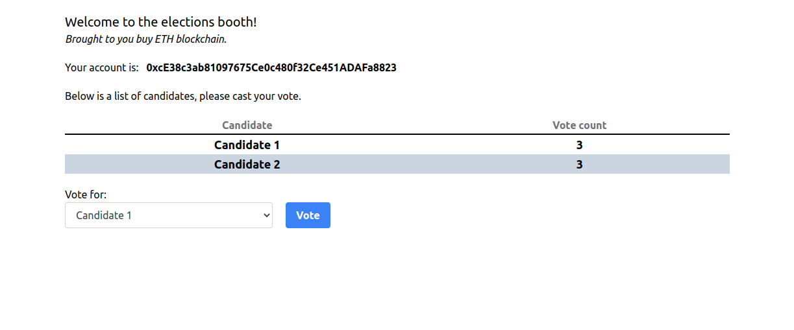

# Elections

Weekend coding session's result, getting hands-on experience with blockchain to grasp the basics of it.
Simple voting application on Ethereum blockchain where a user can cast his vote for a candidate. Requires metamask.

## Tech 

Implemented with Solidity for smart contracts. Frontend written with React, interacts with blockchain via Web3, uses a couple additional libraries to make my life easier, such as tailwindcss.

## Tools used

* Ganache. For a personal blockchain.
* Truffle. For a development environment and testing of a blockchain using EVM.
* Metamask. For a dummy account with ETH from Ganache.

__Because no one has time to setup another man's project.__

## Screenshots

